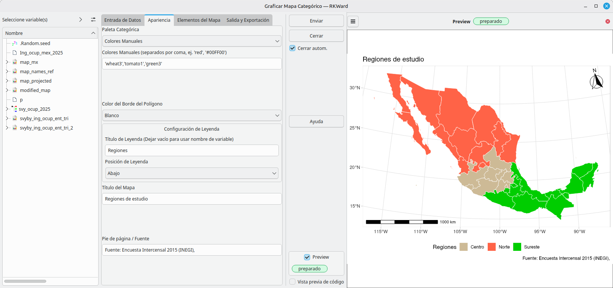

# rk.rnaturalearth: Easy Choropleth Maps for RKWard


[](https://github.com/AlfCano/rk.rnaturalearth/actions/workflows/lintr.yml)


**rk.rnaturalearth** is a user-friendly wrapper for the `rnaturalearth`, `sf`, and `ggspatial` packages within RKWard. It allows users to generate high-quality administrative Choropleth maps (heat maps based on regions) without needing complex GIS knowledge or shapefile management.

This plugin creates a professional, modular workflow for spatial analysis: **Download -> Transform -> Process -> Plot.**

## 🚀 Features

### 1. Modular Workflow
*   **Country Downloader Component:** Fetch administrative boundaries (states/provinces) automatically via `rnaturalearth` and save them as `sf` objects in your workspace.
*   **Separation of Concerns:** Download the map once, then reuse the object for multiple plots or data joins without re-downloading.

### 2. Advanced Visualization Tools
*   **Continuous Maps:** Plot numeric variables (e.g., Population, Income) using color-blind friendly **Viridis** palettes.
*   **Categorical Maps:** Plot discrete groups (e.g., "North vs South", "Electoral Districts") using **RColorBrewer** palettes or manual colors.
*   **Deep Styling Control:**
    *   **Grids:** Choose between Clean (Void), Standard Graticules, or **Dotted Graticules (No Labels)** for a minimalist look.
    *   **Borders:** Customize polygon outline colors (White, Black, Gray, etc.).
    *   **Legends:** Full control over legend position and custom titles.
    
    

### 3. Professional Cartography Elements (`ggspatial` & `ggrepel`)
*   **Smart Labeling (New in v0.1.4):**
    *   **Standard Mode:** Fast labeling with collision detection (`check_overlap`).
    *   **ggrepel Mode:** Uses physics-based positioning to push labels away from each other and the centroids, adding connector lines where necessary.
    *   **Crowd Control:** Adjustable `Max Overlaps` setting to force labels to appear even in dense areas (e.g., small states in the Northeast USA).
*   **North Arrows:** Add "N" arrows with multiple styles (Classic, Fancy, Minimal).
*   **Scale Bars:** Automatically calculated scale bars to provide spatial context.

### 4. Data Helpers
*   **Projection Transformer:** Convert maps from degrees (WGS84) to planar projections (e.g., Web Mercator, Mexico ITRF2008) to fix scale bar warnings and improve geometric accuracy.
*   **Region Name Extractor:** Extract official map names to a data frame to check spelling.
*   **Recoding Tool:** Update map region names using a dictionary data frame to fix mismatches.

## 📦 Installation

To install this plugin in RKWard, copy and run the following code in your R Console:

```R
# install.packages("devtools")
local({
  require(devtools)
  install_github("AlfCano/rk.rnaturalearth", force = TRUE)
})
```

**Note on System Dependencies:**
This plugin relies on the `sf` package. On Linux (Ubuntu/Debian), you may need to install system libraries first:
`sudo apt-get install libudunits2-dev libgdal-dev libgeos-dev`

## 🌍 Internationalization

This plugin is fully localized and automatically adapts to the language settings of your RKWard installation.

**Supported Languages:**
*   🇺🇸 **English** (Default)
*   🇪🇸 **Spanish** (`es`)
*   🇫🇷 **French** (`fr`)
*   🇩🇪 **German** (`de`)
*   🇧🇷 **Portuguese** (Brazil) (`pt_BR`)

If your system language is not listed, the interface will default to English.

## 💻 Usage

Once installed, the tools are organized under:

**`Plots` -> `Maps`**

1.  **Download -> Download Country Map Object:** Start here to get the shapefile.
2.  **Plot Continuous Map:** For numeric heatmaps.
3.  **Plot Categorical Map:** For grouping/regions.
4.  **Get Map Names:** To check spelling.
5.  **Recode Map Regions:** To fix spelling errors in the map object.
6.  **Transform Map Projection:** To convert CRS (e.g., Lat/Lon to Meters).

## 🎓 Quick Start Examples

### Example 1: The Basic Workflow (Continuous)
**Scenario:** Visualizing random "Satisfaction Scores" for Mexico.

**Step 1: Download Map**
*   Open **Download Country Map Object**.
*   Select **Mexico**.
*   Save as: `map_mx`.

**Step 2: Prepare Data (Run in Console)**
```R
# Create synthetic data matching the downloaded map
my_mexico_data <- data.frame(
  StateName = map_mx$name, 
  Score = runif(nrow(map_mx), min = 50, max = 100)
)
```

**Step 3: Plot**
*   Open **Plot Continuous Map**.
*   **Map Object:** `map_mx`.
*   **Data Frame:** `my_mexico_data`.
*   **Joining Columns:** `name` (Map) and `StateName` (Data).
*   **Value Column:** `Score`.
*   **Appearance:** Palette `Magma`, Grid `Clean (Void)`.

---

### Example 2: Categorical Regions
**Scenario:** Coloring states by "Study Region" (North, Center, South).

**Step 1:** Download `map_mx` (if not already done).

**Step 2: Prepare Data (Run in Console)**
```R
# Assign regions randomly for demonstration
my_regions <- data.frame(
  StateName = map_mx$name,
  Region = sample(c("North", "Center", "South"), nrow(map_mx), replace = TRUE)
)
```

**Step 3: Plot**
*   Open **Plot Categorical Map**.
*   **Map Object:** `map_mx`.
*   **Data Frame:** `my_regions`.
*   **Grouping Variable:** `Region`.
*   **Appearance:** 
    *   Palette: `Brewer: Set3`.
    *   Border Color: `White`.
    *   Legend Position: `Right`.

---

### Example 3: Fixing Scale Bars (Projection)
**Problem:** You get a warning "Scale on map varies by more than 10%".
**Solution:** The map is in Degrees (Curved), but needs to be in Meters (Flat).

1.  Open **Transform Map Projection**.
2.  **Map Object:** `map_mx`.
3.  **Target Projection:** `Mexico ITRF2008 / LCC (6362)` (or Web Mercator).
4.  **Save As:** `map_mx_projected`.
5.  Use `map_mx_projected` in the Plotting plugins. The scale bar will now be accurate.

## 🛠️ Dependencies

This plugin relies on the following R packages:
*   `rnaturalearth` (Map data source)
*   `sf` (Simple Features for spatial handling)
*   `ggplot2` (Plotting engine)
*   `ggspatial` (North arrows and scales)
*   `ggrepel` (Smart label positioning)
*   `viridis` (Color blindness-friendly palettes)
*   `RColorBrewer` (Categorical palettes)
*   `dplyr` (Data manipulation)

## ✍️ Author & License

*   **Author:** Alfonso Cano (<alfonso.cano@correo.buap.mx>)
*   **Assisted by:** Gemini, a large language model from Google.
*   **License:** GPL (>= 3)
